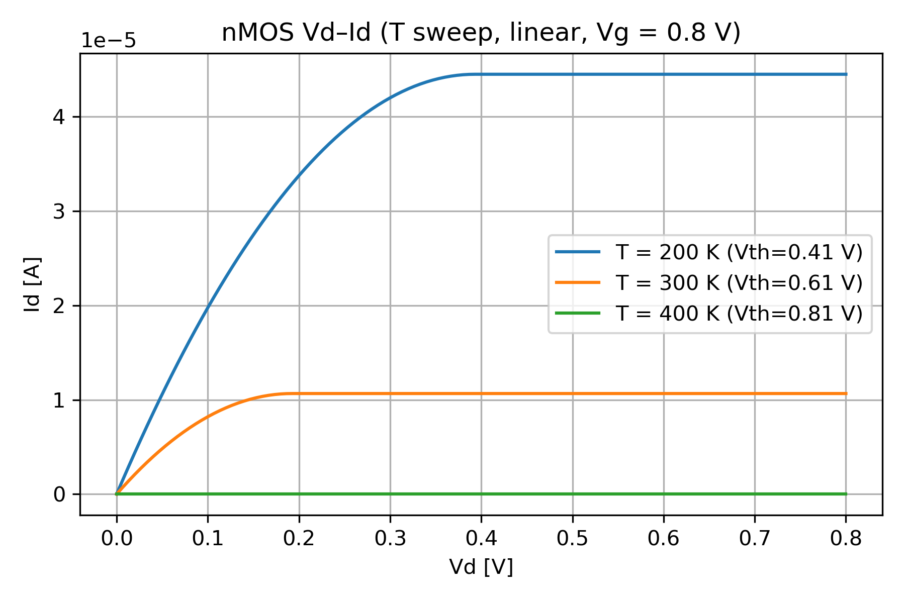
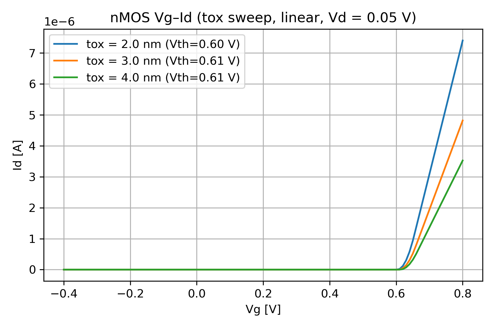

# TCAD_PLAYGROUND

A lightweight Python-based TCAD playground for MOSFET, MOSCAP, and 1D Poisson simulations.  
Designed for education and visualization of semiconductor device physics in VSCode.

---

## 📁 Directory

```
tcad_playground/
├── fig/
│   ├── mosfet_vdid_*         # MOSFET Vd–Id
│   ├── mosfet_vgid_*         # MOSFET Vg–Id
│   ├── moscap_cv_*           # MOSCAP C–V
│   └── ...
├── moscap_cv_*.py            # MOSCAP CV scripts
├── mosfet_vdid_*.py          # MOSFET Vd–Id scripts
├── mosfet_vgid_*.py          # MOSFET Vg–Id scripts
├── poisson_1d.py             # 1D Poisson solver
└── poisson_moscap_1d.py      # Poisson-based MOSCAP
```

---

## 🔧 Requirements

Python 3.10+  
Install packages:

```bash
pip install numpy scipy matplotlib
```

---

# 📊 **Examples**

## **1. MOSFET Vd–Id (Temperature Sweep)**

```bash
python mosfet_vdid_T_sweep_1d.py
```



---

## **2. MOSFET Vg–Id (Oxide Thickness Sweep)**

```bash
python mosfet_vgid_tox_sweep_1d.py
```



---

## **3. MOSCAP C–V**

```bash
python moscap_cv_1d.py
```


---

## 🧩 **Sample: Key Equations Used (Educational Model)**

```python
# Threshold voltage (toy model)
Vth = Vfb + 2*phi_f + np.sqrt(2*eps_si*q*Na*2*phi_f) / Cox

# Mobility model (temperature dependence)
mu = mu_0 * (300 / T)**1.5
```

These simplified equations are used for educational purposes.

---

# 🎯 Future Work
- BSIM-like compact modeling  
- 2D Poisson / Drift–Diffusion  
- Jupyter Notebook version  
- Device optimization toolkit  

---

# 📄 **License (Hybrid)**

| Item | License | Notes |
|------|---------|-------|
| **Source Code** | MIT | Free use / modify / redistribute |
| **Text Materials** | CC BY 4.0 | Attribution required |
| **Figures / Plots** | CC BY-NC 4.0 | Non-commercial only |
| **External References** | Original license | Cite properly |

---

# ✍ Author
Shinichi Samizo  
Project Design Hub / SemiDevKit
